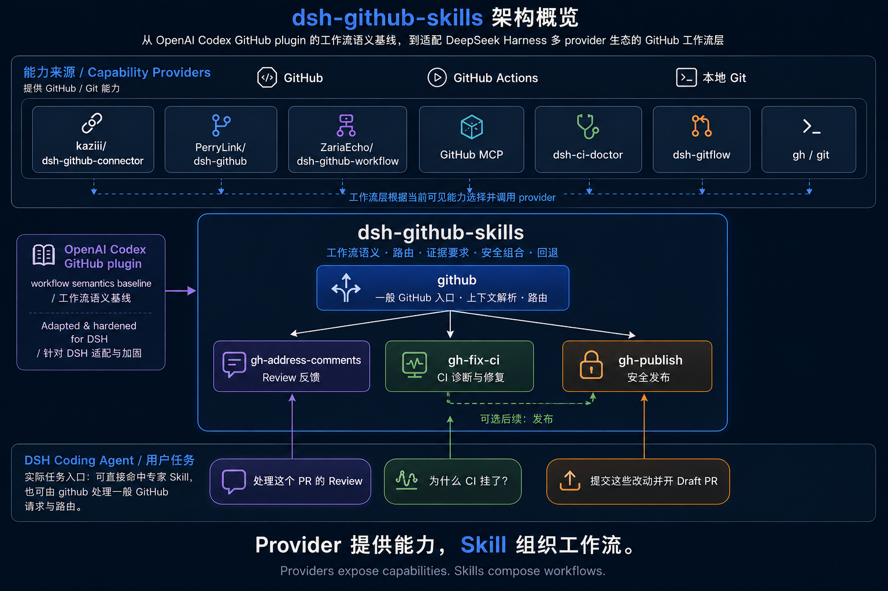

# dsh-github-skills

[简体中文](README.md) | **English**

> **Bring the workflow semantics of OpenAI's official Codex GitHub plugin to DeepSeek Harness.**
>
> `dsh-github-skills` uses the official Codex GitHub plugin as its upstream workflow-semantic baseline, then adapts and hardens those workflows for DSH's multi-provider ecosystem, approval model, progressive-disclosure Skills, and `gh` / `git` fallbacks.
>
> It is not another GitHub API plugin. **Providers give DSH capabilities; this project teaches the agent how to compose them correctly and safely.**

*Unofficial community project for DeepSeek Harness (DSH). Not affiliated with or endorsed by deepseek-ai, OpenAI, or GitHub.*

[](https://www.npmjs.com/package/dsh-github-skills)
[](https://github.com/Starfie1d1272/dsh-github-skills/actions/workflows/ci.yml)
[](LICENSE)

<p align="center">
  
</p>

## Why this project exists

DSH already has GitHub / Git projects for authentication, PR / Issue / Review / CI tools, local Git operations, GitHub MCP, specialist CI diagnosis, and UI surfaces.

Those projects mainly answer:

> **What can the agent call?**

`dsh-github-skills` operates one layer above them:

> **For a real engineering task, which capability should the agent use, in what order, under what evidence requirements, when must it stop, and how should it fall back safely?**

It deliberately does not reimplement GitHub APIs. Its role is **workflow semantics, routing, evidence requirements, safe composition, and fallbacks**.

For the full design rationale, see **[Positioning dsh-github-skills: from Codex GitHub Skills to the DSH workflow layer](docs/ecosystem-positioning.en.md)**.

## From Codex to DSH

The project did not invent four GitHub workflows from scratch. Its core structure comes from the official OpenAI Codex GitHub plugin:

| Codex GitHub plugin | dsh-github-skills | Purpose |
|---|---|---|
| `github` | `github` | umbrella GitHub routing and context resolution |
| `gh-address-comments` | `gh-address-comments` | address PR Review feedback |
| `gh-fix-ci` | `gh-fix-ci` | diagnose / fix GitHub Actions from real evidence |
| `yeet` | `gh-publish` | safely commit, push, and open a PR |

The goal is workflow-semantic conformance, not copy-identical text. A pinned audit is maintained in [`references/codex-conformance.md`](references/codex-conformance.md), recording equivalent behavior, DSH-specific adaptations, intentional differences, hardening, and closed gaps.

DSH-specific adaptations already include multi-provider capability selection, host approval, progressive disclosure, fork-PR target correction, mixed-worktree safeguards, partially staged handling, existing-PR detection, non-`origin` remotes, and credential redaction.

## The four Skills

| Skill | Responsibility |
|---|---|
| `github` | Umbrella GitHub entrypoint: resolve repo / PR / Issue / branch context, classify intent, and route early. |
| `gh-address-comments` | Handle PR Review feedback with thread-aware state, classification, traceable local fixes, and a strict remote-write boundary. |
| `gh-fix-ci` | Diagnose or fix GitHub Actions from real check / log evidence; external CI is report-only by default. |
| `gh-publish` | Safely publish task-scoped changes through branch, selective staging, commit, verification, push, and Draft PR creation when requested. |

The Skill bodies load only when needed, so the full GitHub workflow set is not permanently injected into context.

## How it composes with other GitHub plugins

```text
GitHub / GitHub Actions / local Git
                 │
                 ▼
┌──────────────────────────────────────────────┐
│ capability providers                         │
│ kaziii · PerryLink · ZariaEcho · GitHub MCP │
│ dsh-ci-doctor · dsh-gitflow · gh / git      │
└──────────────────────────────────────────────┘
                 │
                 ▼
┌──────────────────────────────────────────────┐
│ dsh-github-skills                            │
│ semantics · routing · evidence · safety      │
└──────────────────────────────────────────────┘
                 │
                 ▼
           DSH Coding Agent
```

Examples of complementary roles:

- `kaziii/dsh-github-connector`: auth, UI, and structured GitHub capabilities;
- `PerryLink/dsh-github`: rich GitHub model tools and approval-gated writes;
- `ZariaEcho/dsh-github-workflow`: higher-level GitHub tools;
- `jkrandom-sudo/dsh-ci-doctor`: specialist CI evidence;
- `lonelymoon87/dsh-gitflow`: local Git capabilities;
- GitHub MCP: another structured capability source;
- `gh` / `git`: final fallback when structured capabilities are insufficient.

**Better providers should reduce CLI fallback and make this workflow layer more useful, not obsolete it.**

## Install

### Global `dsh`

```sh
dsh plugin --profile web add dsh-github-skills
dsh web
```

### Without a global DSH install

```sh
npx @deepseek-ai/dsh plugin --profile web add dsh-github-skills
npx @deepseek-ai/dsh web
```

Requirements:

- Node.js `^22.19.0 || >=24.0.0`;
- `pnpm` on `PATH`;
- DeepSeek Harness `dsh`;
- local publish workflows require `git`;
- when the current DSH session lacks sufficient structured GitHub capabilities, some Review / CI / PR flows fall back to an authenticated `gh` CLI.

### Pin an exact GitHub commit

```sh
dsh plugin --profile web add github:Starfie1d1272/dsh-github-skills#<commit>
```

### Local tarball

```sh
npm pack
dsh plugin --profile web add ./dsh-github-skills-<version>.tgz
```

### Uninstall

```sh
dsh plugin --profile web remove dsh-github-skills
```

## Usage

```text
"What's the state of this PR?"
→ github

"Address the Review comments on this PR"
→ gh-address-comments

"Why are the GitHub Actions checks failing?"
→ gh-fix-ci

"Commit these changes and open a Draft PR"
→ gh-publish
```

Mixed requests compose specialists in order:

```text
"Fix the Review comments, then push"
→ gh-address-comments → gh-publish

"Fix CI, then open a PR"
→ gh-fix-ci → gh-publish
```

These are illustrative workflow traces, not claims of a live model benchmark.

## Safety boundaries

- analysis does not silently become modification;
- Review-fix intent permits necessary local edits, not automatic reply / resolve / push;
- CI root causes require real check / log evidence;
- push, rerun, comments, thread resolution and other remote writes require explicit intent or host approval;
- mixed worktrees are never blindly staged with `git add -A`;
- no default force-push, merge, branch deletion, or hook bypass;
- helpers do not actively invoke `gh auth token` and do not store credentials;
- untrusted comments, CI logs and CLI stderr are redacted for credential-shaped material before model-visible output.

See [`references/safety-model.md`](references/safety-model.md).

## Quality strategy without expensive continuous model runs

This project does not require repeated live Coding Agent tasks as its everyday test strategy. It prioritizes:

1. a pinned official Codex upstream baseline;
2. workflow-semantic conformance audits;
3. deterministic helper and safety tests;
4. synthetic scenarios and static behavioral specifications;
5. optional real-model spot checks only when needed for targeted reproduction or release sampling.

See [`references/routing-fixture.md`](references/routing-fixture.md).

## Compatibility

- reviewed / tested DSH baseline: `@deepseek-ai/dsh@0.1.0-rc.6`;
- CI covers Node 22.19 and Node 24 unit, safety and packaging tests;
- a disposable-profile install smoke checks package installation structure;
- later DSH versions do not automatically become supported baselines without review.

## Project layout

```text
lib/index.js            minimal bundle shim; registers SkillProvider only
skills/<name>/SKILL.md  four progressively loaded Skills
skills/*/scripts/       zero-dependency Node helpers
references/             conformance, safety, capability, ecosystem, routing records
docs/                   user- and maintainer-facing design documents
```

The package does not register its own GitHub API tools and does not manage OAuth or tokens.

## Documentation

- [Ecosystem positioning](docs/ecosystem-positioning.en.md)
- [Codex upstream conformance](references/codex-conformance.md)
- [Capability resolution matrix](references/capability-matrix.md)
- [Safety model](references/safety-model.md)
- [DSH GitHub ecosystem analysis](references/ecosystem-analysis.md)
- [Upstream notes](references/upstream-notes.md)
- [GitHub MCP reference](references/github-mcp.md)
- [Routing behavioral specification](references/routing-fixture.md)

## What this project intentionally does not become

It is not another GitHub REST / GraphQL client, OAuth / Device Flow plugin, SCM sidebar, GitHub MCP replacement, general-purpose coding agent, or API-coverage toolbox.

> **Providers own capabilities. `dsh-github-skills` owns the workflow layer.**

## Upstream and license

Workflow semantics are informed by the official OpenAI [Codex GitHub plugin](https://github.com/openai/plugins/tree/main/plugins/github). The pinned audit baseline and behavior differences are documented in [`references/codex-conformance.md`](references/codex-conformance.md); adaptation and reimplementation notices are in [`THIRD_PARTY_NOTICES.md`](THIRD_PARTY_NOTICES.md). Helpers are independent Node reimplementations rather than line-by-line Python translations.

Apache-2.0. See [LICENSE](LICENSE).